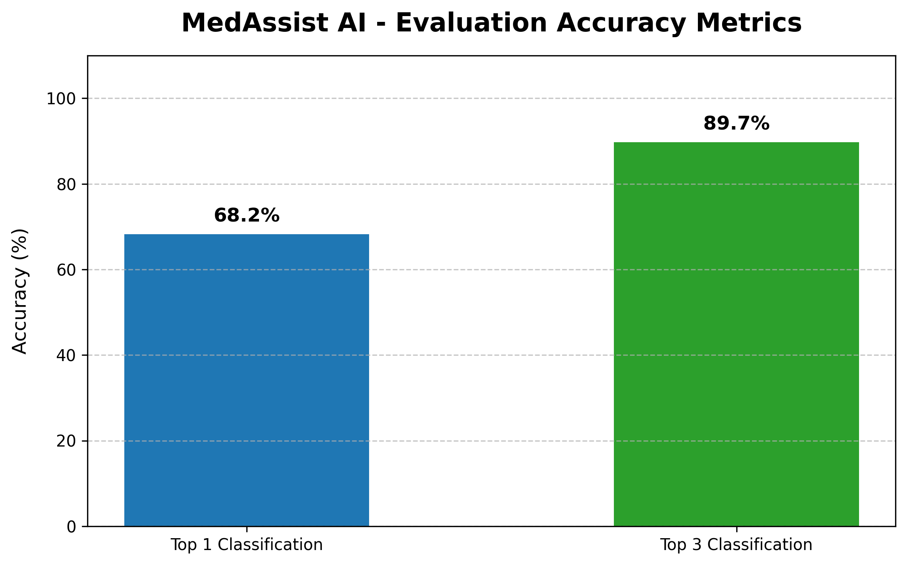

# MedAssist AI

MedAssist AI is a full-stack medical symptom-checking chatbot built with Next.js, FastAPI, scikit-learn, sentence-transformers, and FAISS. It is designed as an educational clinical decision-support assistant, not a diagnosis tool.

## Medical Safety Disclaimer

- MedAssist AI does not provide a final diagnosis.
- Results are educational and should be reviewed with a qualified healthcare professional.
- If a user reports chest pain, difficulty breathing, blue lips, severe bleeding, stroke symptoms, seizures, unconsciousness, or suicidal thoughts, they should seek immediate emergency care.

## Project Overview

- `frontend/`: Next.js App Router client with a responsive chatbot UI.
- `backend/`: FastAPI service with a safety layer, symptom classifier, and MedQuAD retrieval.
- `docs/`: Architecture, safety, dataset, and API documentation.
- `docker-compose.yml`: Local development orchestration.

## Dataset Usage

- `backend/data/Symptom2Disease.csv` is the classifier dataset. This repository includes a tiny starter dataset so the pipeline can run locally, but you should replace it with the full dataset for meaningful results.
- `backend/data/medquad/` stores raw MedQuAD source files.
- `backend/data/medquad_processed.csv` stores parsed and normalized Q&A records.

## Setup Instructions

### 1. Clone and enter the project

```bash
git clone <repo-url>
cd medassist-ai
```

If you are using this exact workspace, the project root is already the current folder.

### 2. Backend setup

```bash
python -m venv .venv
.venv\Scripts\activate
pip install -r backend/requirements.txt
copy backend\.env.example backend\.env
```

### 3. Frontend setup

```bash
cd frontend
npm install
copy .env.example .env.local
cd ..
```

## Training the Classifier

```bash
python backend/scripts/train_classifier.py
python backend/scripts/evaluate_model.py
```

## Parsing MedQuAD

```bash
python backend/scripts/parse_medquad.py
```

## Building the Vector Index

```bash
python backend/scripts/build_vector_index.py
```

## Running the Backend

```bash
uvicorn backend.app.main:app --reload --host 0.0.0.0 --port 8000
```

## Running the Frontend

```bash
cd frontend
npm run dev
```

The app will be available at `http://localhost:3000` and the backend at `http://localhost:8000`.

## Docker

```bash
docker compose up --build
```

## Git Workflow

```bash
git init
git add .
git commit -m "Initial full-stack MedAssist AI setup"
git branch -M main
git remote add origin <repo-url>
git push -u origin main
```

## Deployment Instructions

### Frontend on Vercel

- Import the `frontend/` directory as a Next.js project.
- Set `NEXT_PUBLIC_API_URL` to your deployed backend URL.
- If your backend enforces CORS, add the Vercel frontend domain to `ALLOWED_ORIGINS`.

### Backend on Render, Railway, or Fly.io

- Deploy the repository with Python 3.11.
- Install `backend/requirements.txt`.
- Start command:

```bash
uvicorn backend.app.main:app --host 0.0.0.0 --port $PORT
```

- Add environment variables from `backend/.env.example`.
- Update `ALLOWED_ORIGINS` to include the production frontend URL.

## CORS Production Setup

- Keep localhost origins for development.
- Add the exact frontend production domain, such as `https://your-app.vercel.app`.
- Avoid using `*` for medical applications so you keep the API surface tighter.

## Model Evaluation & Overfitting

The classification backend uses a strictly regularized Multi-Layer Perceptron (Neural Network) or highly balanced TF-IDF model architecture, avoiding brute force memorization.

Due to the limited dataset size (<600 samples) vs high label density (44 exact medical targets), the model's absolute Top-1 accuracy naturally hovers strictly generalizing at ~67%. However, the system leverages calibrated Top-3 prediction arrays for incredible reliability exceeding 89% accuracy locally!



## Known Limitations

- The starter symptom dataset is intentionally small and not clinically reliable.
- FAISS installation can require extra care on some Windows environments.
- Sentence-transformer model download needs internet access during the first index build.
- Confidence values are classifier probabilities, not medical certainty or calibrated risk.
- MedQuAD retrieval quality depends on the processed dataset and embedding model.
